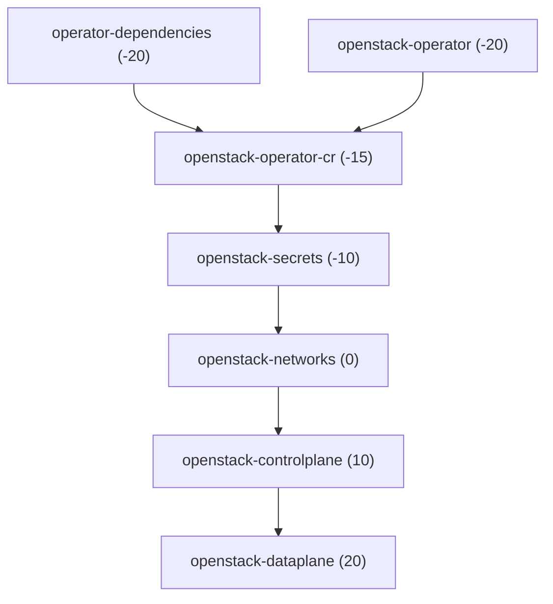

# rhoso-apps Helm chart

This chart renders Argo CD `Application` resources to deploy Red Hat OpenStack Services on OpenShift (RHOSO) and related manifests from Git. Chart-wide defaults apply to every rendered application; each entry under `applications` is optional and can be toggled or overridden independently.

## Basic usage

From the chart directory (for example `charts/rhoso-apps`), install with the bundled `values.yaml` and a release name of your choice:

```bash
helm install deploy-rhoso . -f values.yaml
```

To render manifests without applying (for example to inspect or pipe to a file):

```bash
helm template deploy-rhoso . -f values.yaml
```

Defaults for `applications` and global settings are defined in `values.yaml`. Use additional `-f` files to layer environment-specific overrides; see [Advanced usage and examples](#advanced-usage-and-examples).

## Chart-wide values

| Key | Type | Description |
|-----|------|-------------|
| `applicationNamespace` | string | Namespace for the Argo CD `Application` CRs (`metadata.namespace`). Default: `openshift-gitops`. |
| `destinationServer` | string | `spec.destination.server` for every application. Default: `https://kubernetes.default.svc`. |

This chart does not set `spec.destination.namespace`; only `destination.server` is set (from `destinationServer`).

## Per-application keys (`applications.<name>`)

Each `<name>` is a unique key (DNS-1123). Set `enabled: true` to render that `Application`; set `enabled: false` to skip it.

| Key | Type | Description |
|-----|------|-------------|
| `enabled` | bool | If `true`, render an `Application` CR; if `false`, skip. |
| `repoURL` | string | `spec.source.repoURL` (Git URL). |
| `path` | string | Directory in the repo; empty uses default `"."`. |
| `targetRevision` | string | Branch, tag, or commit; empty uses default `"HEAD"`. |
| `syncWave` | string | `argocd.argoproj.io/sync-wave` annotation. Optional; the chart default is `0` in the rendered manifest when unset. |
| `syncOptions` | list | Optional strings for `spec.syncPolicy.syncOptions` (for example `Prune=true`). Used when `syncPolicy` is not set, or is an empty map: if you set a **non-empty** `syncPolicy`, top-level `syncOptions` is **ignored** (put options under `syncPolicy.syncOptions` instead). |
| `kustomize` | map | Optional; passed to `spec.source.kustomize` (`namePrefix`, `patches`, `components`, etc.). See [Argo CD Kustomize](https://argo-cd.readthedocs.io/en/stable/user-guide/kustomize/). |
| `finalizers` | list | `metadata.finalizers` (Argo CD resources finalizer). Valid: `resources-finalizer.argocd.argoproj.io/background` or `.../foreground`. Omit to use chart default (background). |
| `project` | string | Argo CD `AppProject`; default `default` if unset. |
| `syncPolicy` | map | When non-empty, this map **is** `spec.syncPolicy` (including `automated` and nested `syncOptions`, etc.). Set `automated` (with optional `prune` / `selfHeal`) for [automatic sync](https://argo-cd.readthedocs.io/en/stable/user-guide/auto_sync/). In that case top-level `syncOptions` from this chart is ignored, including values inherited from `values.yaml` overlays. |

### Adding a new application

Copy a block under `applications`, choose a unique key, set `enabled: true`, and set `repoURL`, `path`, and `targetRevision` as needed.

## Advanced usage and examples

Helm merges values files left to right: later files override earlier ones. Keep a **base** `values.yaml` (or your fork of the chart defaults) and add **environment** files that only change what differs (for example one Git revision, one path, or a single application). In the YAML snippets below, string values use double quotes; booleans and other non-string scalars are left unquoted.

**Contents:** [Install with base + environment file](#install-with-base-environment-file) · [Scaling out on Day 2](#example-scaling-out-on-day-2-gitops-friendly) · [Override Git revision](#example-override-git-revision-for-all-apps-that-share-defaults) · [Change one application](#example-change-only-one-application) · [Automated sync](#example-automated-sync-for-one-application) · [Kustomize overrides](#example-kustomize-overrides-for-one-application) · [Chart-wide + per-app overlay](#example-chart-wide-per-app-in-one-overlay)

### Install with base + environment file

```bash
helm install deploy-rhoso . \
  -f values.yaml \
  -f values-prod.yaml
```

Use any release name and paths; `values-prod.yaml` can be minimal.

### Example: scaling out on Day 2 (GitOps-friendly)

Commit the scaled dataplane manifests under a dedicated directory in your app repo, then repoint the `openstack-dataplane` application to that path. The chart only changes the Argo CD `Application` source; Git remains the source of truth for the actual scale change.

`values-scale-out.yaml`:

```yaml
applications:
  openstack-dataplane:
    path: "environments/cluster01/scaling-2026-04-01"
```

```bash
helm upgrade deploy-rhoso . -f values.yaml -f values-prod.yaml -f values-scale-out.yaml
```

### Example: override Git revision for all apps that share defaults

`values-revision.yaml`:

```yaml
applications:
  operator-dependencies:
    targetRevision: "main"
  openstack-operator:
    targetRevision: "main"
  openstack-operator-cr:
    targetRevision: "main"
  openstack-secrets:
    targetRevision: "main"
  openstack-networks:
    targetRevision: "main"
  openstack-controlplane:
    targetRevision: "main"
  openstack-dataplane:
    targetRevision: "main"
```

```bash
helm template deploy-rhoso . -f values.yaml -f values-revision.yaml
```

### Example: change only one application

Disable or repoint a single app without repeating the rest of `values.yaml`:

`values-disable-dataplane.yaml`:

```yaml
applications:
  openstack-dataplane:
    enabled: false
```

`values-custom-controlplane-path.yaml`:

```yaml
applications:
  openstack-controlplane:
    path: "environments/prod/controlplane"
    targetRevision: "v1.2.3"
```

```bash
helm install deploy-rhoso . -f values.yaml -f values-custom-controlplane-path.yaml
```

### Example: automated sync for one application

The default `values.yaml` does not set `spec.syncPolicy.automated`; Argo CD stays on manual sync until you add it. Set `syncPolicy.automated` on an application to enable automatic sync, pruning, and self-heal. The chart sets `spec.syncPolicy` from the `syncPolicy` value when it is a non-empty map, and does **not** apply top-level `syncOptions` in that case—so chart defaults like `Prune=true` on that app are not merged in unless you add them under `syncPolicy.syncOptions` yourself.

`values-automated-operator-deps.yaml`:

```yaml
applications:
  operator-dependencies:
    syncPolicy:
      automated:
        prune: true
        selfHeal: true
```

If you need `spec.syncPolicy.syncOptions` (for example `Prune=true`) while using `syncPolicy`, list them under `syncPolicy.syncOptions` rather than only at the top level.

```bash
helm upgrade deploy-rhoso . -f values.yaml -f values-automated-operator-deps.yaml
```

### Example: Kustomize overrides for one application

`values-dev-prefix.yaml`:

```yaml
applications:
  openstack-networks:
    kustomize:
      namePrefix: "dev-"
```

```bash
helm upgrade deploy-rhoso . -f values.yaml -f values-dev-prefix.yaml
```

### Example: chart-wide + per-app in one overlay

`values-staging.yaml`:

```yaml
destinationServer: "https://kubernetes.default.svc"
applications:
  openstack-operator:
    targetRevision: "staging"
  openstack-controlplane:
    syncWave: "15"
```

Later keys win for the same path; unspecified keys under `applications.<name>` keep values from `values.yaml`.

## Default applications (from `values.yaml`)

These entries ship enabled by default; each has a `syncWave` that defines Argo CD apply order (lower waves first).

Install and configure `vault-secrets-operator` or `external-secrets-operator` in `operator-dependencies`. The `openstack-secrets`
application is a later wave: manifests that create cluster secrets by syncing from the secure backend (for example
`VaultStaticSecret` or ExternalSecret resources), not deployment of the secrets operator itself.

### `openstack-secrets` path

The chart default uses a placeholder `path` (`TODO` in `values.yaml`) so the structure is visible. Before relying on this Application in a real cluster, set `path` to a directory in **your** Git repository that contains manifests which sync cluster secrets from your secure store (for example Vault StaticSecrets or ExternalSecrets). Until that path is valid, expect **only** the `openstack-secrets` Application to fail in Argo CD; other Applications from this chart are unchanged. You may set `enabled: false` under `applications.openstack-secrets` until the path is ready.

| Application | Purpose (summary) | Default `syncWave` |
|-------------|---------------------|--------------------|
| `operator-dependencies` | MetalLB, nmstate, cert-manager; VSO or ESO install | `-20` |
| `openstack-operator` | OpenStack operator | `-20` |
| `openstack-operator-cr` | Main OpenStack custom resource | `-15` |
| `openstack-secrets` | Cluster secrets from secure backend (configure `path`) | `-10` |
| `openstack-networks` | Control plane and dataplane networks | `0` |
| `openstack-controlplane` | `OpenStackControlPlane` | `10` |
| `openstack-dataplane` | Data plane node set and deployment | `20` |

## Default application ordering (sync waves)



## Lifecycle management

### Upgrading and Day-2 operations

When updating an existing deployment (for example changing `path` or `targetRevision` for a specific application), **re-pass every values file** used during the initial install so the release stays aligned with your Git source of truth.

```bash
helm upgrade deploy-rhoso . \
  -f values.yaml \
  -f values-custom.yaml \
  -f values-upgrade-01.yaml
```

**`--reuse-values`:** Helm can merge new overrides with values stored in the cluster. Use that flag with care: it can leave **ghost values** (old settings you meant to remove) or miss new chart defaults after a chart version bump.

**Argo CD sync notice:** This chart only updates Argo CD `Application` manifests. After `helm upgrade`, confirm in the Argo CD UI (or CLI) that child applications (for example `openstack-controlplane`) sync to the new `targetRevision` or `path`.

## See also

This README describes this Helm chart: values, rendered Argo CD `Application` manifests, and install or upgrade patterns. Broader operations—rollback strategy, disaster recovery, backup and restore, or adopting existing clusters in Argo CD—are out of scope here; use your platform, OpenShift GitOps, and product documentation for those topics.

- [Argo CD Application specification](https://argo-cd.readthedocs.io/en/stable/operator-manual/application-specification/)
- [Red Hat OpenShift GitOps documentation](https://docs.redhat.com/en/documentation/red_hat_openshift_gitops/)
- [Working with Helm charts](https://docs.redhat.com/en/documentation/openshift_container_platform/4.18/html/building_applications/working-with-helm-charts) (OpenShift Container Platform 4.18)
- Chart templates: `templates/application.yaml`, `templates/_helpers.tpl`
