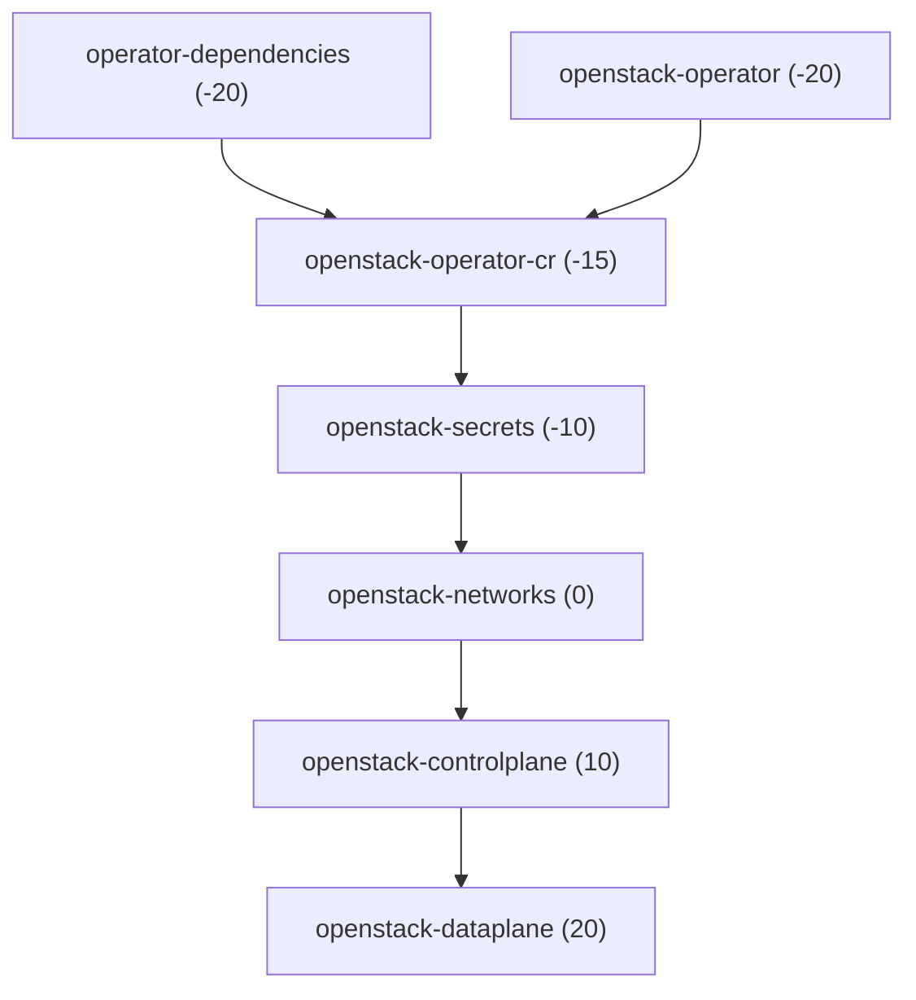

# rhoso-apps Helm chart

**Contents**

* [Basic usage](#basic-usage)
* [Chart-wide values](#chart-wide-values)
* [Per-application keys](#per-application-keys)
* [Advanced usage and examples](#advanced-usage-and-examples)
* [Default applications](#default-applications)
* [Secret zero](#bootstrap-credential-for-vault-secret-zero-on-openshift)
* [Lifecycle management](#lifecycle-management)
* [See also](#see-also)

This chart renders Argo CD `Application` resources to deploy Red Hat OpenStack
Services on OpenShift (RHOSO) and related manifests from Git. Chart-wide
defaults apply to every rendered application; each entry under `applications`
is optional and can be toggled or overridden independently.

## Basic usage

From the chart directory (for example `charts/rhoso-apps`), install with the
bundled `values.yaml` and a release name of your choice:

```bash
helm install deploy-rhoso . -f values.yaml
```

To render manifests without applying (for example to inspect or pipe to a
file):

```bash
helm template deploy-rhoso . -f values.yaml
```

Defaults for `applications` and global settings are defined in `values.yaml`.
Use additional `-f` files to layer environment-specific overrides; see
[Advanced usage and examples](#advanced-usage-and-examples).

## Chart-wide values

| Key | Type | Description |
|-----|------|-------------|
| `applicationNamespace` | string | Namespace for rendered `Application` CRs. |
| `destinationServer` | string | `spec.destination.server`. |

Defaults: `openshift-gitops` and `https://kubernetes.default.svc`. This chart
does not set `spec.destination.namespace`; only `destination.server` is set
from `destinationServer`.

## Per-application keys

Each `applications.<name>` key is a unique name (DNS-1123). Set `enabled: true`
to render that `Application`; set `enabled: false` to skip it.

| Key | Type | Description |
|-----|------|-------------|
| `enabled` | bool | If `true`, render an `Application` CR; if `false`, skip. |
| `repoURL` | string | `spec.source.repoURL` (Git URL). |
| `path` | string | Directory in the repo; empty uses default `"."`. |
| `targetRevision` | string | Branch, tag, or commit; default `"HEAD"`. |
| `syncWave` | string | `argocd.argoproj.io/sync-wave` (default `0`). |
| `syncOptions` | list | Top-level sync opts; ignored if `syncPolicy` is set. |
| `kustomize` | map | Map for `spec.source.kustomize`. [Docs][argo-kustomize]. |
| `finalizers` | list | Argo `Application` finalizers (`metadata.finalizers`). |
| `project` | string | Argo CD `AppProject`; default `default` if unset. |
| `syncPolicy` | map | App `syncPolicy`. See [auto sync][argo-auto-sync]. |

### Adding a new application

Copy a block under `applications`, choose a unique key, set `enabled: true`,
and set `repoURL`, `path`, and `targetRevision` as needed.

## Advanced usage and examples

Helm merges values files left to right: later files override earlier ones. Keep
a **base** `values.yaml` (or your fork of the chart defaults) and add
**environment** files that only change what differs (for example one Git
revision, one path, or a single application). In the YAML snippets below,
string values use double quotes; booleans and other non-string scalars are left
unquoted.

**Section contents**

* [Install with env file](#install-with-base-and-environment-file)
* [Scaling out on Day 2](#example-scaling-out-on-day-2-gitops-friendly)
* [Git rev](#example-override-git-revision-for-all-apps-that-share-defaults)
* [Change one application](#example-change-only-one-application)
* [Automated sync](#example-automated-sync-for-one-application)
* [Kustomize overrides](#example-kustomize-overrides-for-one-application)
* [Chart-wide + per-app overlay](#example-chart-wide-per-app-in-one-overlay)

### Install with base and environment file

```bash
helm install deploy-rhoso . \
  -f values.yaml \
  -f values-prod.yaml
```

Use any release name and paths; `values-prod.yaml` can be minimal.

### Example: scaling out on Day 2 (GitOps-friendly)

Commit the scaled dataplane manifests under a dedicated directory in your app
repo, then repoint the `openstack-dataplane` application to that path. The
chart only changes the Argo CD `Application` source; Git remains the source of
truth for the actual scale change.

`values-scale-out.yaml`:

```yaml
applications:
  openstack-dataplane:
    path: "environments/cluster01/scaling-2026-04-01"
```

```bash
helm upgrade deploy-rhoso . \
  -f values.yaml \
  -f values-prod.yaml \
  -f values-scale-out.yaml
```

### Example: override Git revision for all apps that share defaults

`values-revision.yaml`:

```yaml
applications:
  operator-dependencies:
    targetRevision: "main"
  openstack-operator:
    targetRevision: "main"
  openstack-operator-cr:
    targetRevision: "main"
  openstack-secrets:
    targetRevision: "main"
  openstack-networks:
    targetRevision: "main"
  openstack-controlplane:
    targetRevision: "main"
  openstack-dataplane:
    targetRevision: "main"
```

```bash
helm template deploy-rhoso . -f values.yaml -f values-revision.yaml
```

### Example: change only one application

Disable or repoint a single app without repeating the rest of `values.yaml`:

`values-disable-dataplane.yaml`:

```yaml
applications:
  openstack-dataplane:
    enabled: false
```

`values-custom-controlplane-path.yaml`:

```yaml
applications:
  openstack-controlplane:
    path: "environments/prod/controlplane"
    targetRevision: "v1.2.3"
```

```bash
helm install deploy-rhoso . \
  -f values.yaml \
  -f values-custom-controlplane-path.yaml
```

### Example: automated sync for one application

The default `values.yaml` does not set `spec.syncPolicy.automated`; Argo CD
stays on manual sync until you add it. Set `syncPolicy.automated` on an
application to enable automatic sync, pruning, and self-heal. The chart sets
`spec.syncPolicy` from the `syncPolicy` value when it is a non-empty map, and
does **not** apply top-level `syncOptions` in that case—so chart defaults like
`Prune=true` on that app are not merged in unless you add them under
`syncPolicy.syncOptions` yourself.

`values-automated-operator-deps.yaml`:

```yaml
applications:
  operator-dependencies:
    syncPolicy:
      automated:
        prune: true
        selfHeal: true
```

If you need `spec.syncPolicy.syncOptions` (for example `Prune=true`) while using
`syncPolicy`, list them under `syncPolicy.syncOptions` rather than only at the
top level.

```bash
helm upgrade deploy-rhoso . \
  -f values.yaml \
  -f values-automated-operator-deps.yaml
```

### Example: Kustomize overrides for one application

`values-dev-prefix.yaml`:

```yaml
applications:
  openstack-networks:
    kustomize:
      namePrefix: "dev-"
```

```bash
helm upgrade deploy-rhoso . -f values.yaml -f values-dev-prefix.yaml
```

### Example: chart-wide + per-app in one overlay

`values-staging.yaml`:

```yaml
destinationServer: "https://kubernetes.default.svc"
applications:
  openstack-operator:
    targetRevision: "staging"
  openstack-controlplane:
    syncWave: "15"
```

Later keys win for the same path; unspecified keys under `applications.<name>`
keep values from `values.yaml`.

## Default applications

These entries ship enabled by default in chart `values.yaml` (except
`openstack-secrets`, which defaults to `enabled: false` until you configure it).
Each application has a `syncWave` that defines Argo CD apply order (lower waves
first).

The `operator-dependencies` application installs cluster infrastructure (for
example MetalLB, nmstate, cert-manager) and can include **Vault Secrets
Operator** or **External Secrets Operator** when you add the matching Kustomize
component via Helm overrides (see
[Secret zero](#bootstrap-credential-for-vault-secret-zero-on-openshift)).
The `openstack-secrets` application runs after the operator is available: its
Git-sourced manifests define how the cluster syncs secrets from your secure
backend (for example `VaultStaticSecret` or `ExternalSecret` resources), not
installation of the secrets operator itself.

### `openstack-secrets` path

Chart `values.yaml` still uses a placeholder `path` (`TODO`) so the
`applications.openstack-secrets` block documents the expected keys. By default
`applications.openstack-secrets.enabled` is `false`, so Helm does **not** render
an `openstack-secrets` Argo CD `Application` and nothing fails in Argo CD for
that entry while you prepare Git. To sync secrets from your secure store, set
`enabled: true` in your Helm overrides **and** set `path` (and usually `repoURL`
/ `targetRevision`) to a real directory in **your** repository whose manifests
define that sync (for example Vault StaticSecrets or ExternalSecrets). Until you
opt in with `enabled: true` and a valid path, leave the application disabled;
other Applications from this chart are unchanged.

| Application | Purpose (summary) | Default `syncWave` |
|-------------|---------------------|--------------------|
| `operator-dependencies` | Infra + optional VSO/ESO (`components`). | `-20` |
| `openstack-operator` | OpenStack operator | `-20` |
| `openstack-operator-cr` | Main OpenStack custom resource | `-15` |
| `openstack-secrets` | Secure-backend sync (`path`, enable app). | `-10` |
| `openstack-networks` | Control plane and dataplane networks | `0` |
| `openstack-controlplane` | `OpenStackControlPlane` | `10` |
| `openstack-dataplane` | Data plane node set and deployment | `20` |

### Default application ordering (sync waves)


```mermaid
flowchart TD
A["operator-dependencies (-20)"] --> C["openstack-operator-cr (-15)"]
B["openstack-operator (-20)"] --> C["openstack-operator-cr (-15)"]
C --> D["openstack-secrets (-10)"]
D --> E["openstack-networks (0)"]
E --> F["openstack-controlplane (10)"]
F --> G["openstack-dataplane (20)"]
```

## Bootstrap credential for Vault secret zero on OpenShift

RHOSO GitOps flows often use a secure store (for example HashiCorp Vault) so
OpenShift can reconcile application secrets without storing them in Git. Before
those mechanisms run, the cluster needs a **bootstrap credential** (sometimes
called **secret zero**): the Kubernetes `Secret` (or equivalent material) that
authenticates the secrets operator to Vault. That credential must **not** be
stored in Git. Commit only non-sensitive wiring (Kustomize patches,
`secretRef` names, URLs, and operator CRs that reference secrets by name).

Follow these steps on OpenShift (`oc`); align namespaces and CR kinds with your
chosen operator and RHOSO product documentation.

1. **Create the `openstack` namespace** (or the namespace where your Vault
   connector CRs and referenced secrets will live, if your docs prescribe a
   different name):

   ```bash
   oc create namespace openstack
   ```

2. **Create the Kubernetes `Secret` out of band** with the fields your connector
   expects. The exact keys depend on whether you use Vault Secrets Operator (for
   example AppRole role ID and secret ID) or External Secrets Operator (for
   example tokens or CA bundles). Use `oc create secret generic ...` or your
   approved secret-injection pipeline. Do not commit the secret manifest to
   Git.

3. **Add a Kustomize overlay in Git** for the `openstack-secrets` Argo CD
   application source: manifests that declare the Vault or external-secrets
   connection (`VaultConnection`, `VaultAuth`, `SecretStore`, and so on) and any
   **non-secret** configuration. Use Kustomize `patches` or `components` so
   `secretRef` values match the name and keys of the `Secret` you created in
   step 2.

4. **Point Helm values at that overlay** for `applications.openstack-secrets`:
   set `enabled: true`, `repoURL`, `path`, and `targetRevision` to your
   repository, and use `applications.openstack-secrets.kustomize` so Argo CD
   passes the same `patches` / `components` you use locally. The rendered
   `Application` is what Helm produces from this chart; the child sync still
   applies your Git directory plus those Kustomize options.

5. **Install the secrets operator via `operator-dependencies`:** in your Helm
   override file, under `applications.operator-dependencies`, set
   `kustomize.components` to include **one** install path from this repository.
   Authoritative URLs and the difference between External Secrets Operator
   community (`components`) and Red Hat (`resources` base) are documented in
   [components/secrets/README.md](../../components/secrets/README.md). Pin each
   remote URL with `?ref=` (branch or tag).

   - Vault Secrets Operator: add the `vault-secrets-operator` component URL from
     [components/secrets/README.md](../../components/secrets/README.md) under
     `kustomize.components` (pin with `?ref=`).
   - External Secrets Operator (community): add the `community` component URL
     from the same README.

   For Red Hat External Secrets Operator, use the **resources** base URL from
   [components/secrets/README.md](../../components/secrets/README.md) instead of
   listing it under `components`.

### Helm override pattern (abbreviated)

The following illustrates how Helm values map to Argo CD `spec.source.kustomize`
for **operator-dependencies** (install VSO from this repo) and
**openstack-secrets** (enable the app, point at your Git path, patch a
`VaultAuth` to use a cluster `Secret` name that you created with `oc`).
Placeholder values show the shape only; substitute your Git URLs, revisions,
resource names, and `secretRef` strings.

`operator-dependencies` excerpt:

```yaml
applications:
  operator-dependencies:
    kustomize:
      components:
        - "https://github.com/openstack-k8s-operators/gitops/components/secrets/vault-secrets-operator?ref=v0.2.0"
```

`openstack-secrets` excerpt (Vault Secrets Operator style patch; adjust for
External Secrets if you use ESO):

```yaml
applications:
  openstack-secrets:
    enabled: true
    path: "path/to/your/openstack-secrets-overlay"
    repoURL: "https://example.com/your/gitops.git"
    targetRevision: "main"
    kustomize:
      patches:
        - target:
            kind: VaultAuth
            name: your-vaultauth-name
            namespace: openstack
          patch: |-
            - op: replace
              path: /spec/appRole/secretRef
              value: "your-vault-approle-secret-name"
      components:
        - "https://example.com/your/gitops.git/path/to/shared/manifests?ref=main"
```

A fuller real-world overlay may combine additional `components` (for example
hooks) on `operator-dependencies` and more patches on `openstack-secrets`; the
same Helm keys apply.

## Lifecycle management

### Upgrading and Day-2 operations

When updating an existing deployment (for example changing `path` or
`targetRevision` for a specific application), **re-pass every values file** used
during the initial install so the release stays aligned with your Git source of
truth.

```bash
helm upgrade deploy-rhoso . \
  -f values.yaml \
  -f values-custom.yaml \
  -f values-upgrade-01.yaml
```

**`--reuse-values`:** Helm can merge new overrides with values stored in the
cluster. Use that flag with care: it can leave **ghost values** (old settings
you meant to remove) or miss new chart defaults after a chart version bump.

**Argo CD sync notice:** This chart only updates Argo CD `Application`
manifests. After `helm upgrade`, confirm in the Argo CD UI (or CLI) that child
applications (for example `openstack-controlplane`) sync to the new
`targetRevision` or `path`.

## See also

This README describes this Helm chart: values, rendered Argo CD `Application`
manifests, and install or upgrade patterns. Broader operations—rollback
strategy, disaster recovery, backup and restore, or adopting existing clusters
in Argo CD—are out of scope here; use your platform, OpenShift GitOps, and
product documentation for those topics.

- [Argo CD Application specification][argo-app-spec]
- [Red Hat OpenShift GitOps documentation][rh-gitops-doc]
- [OpenShift Helm charts][ocp-helm] (OpenShift Container Platform 4.18)
- [Secrets operator components][secrets-components] (VSO and ESO Kustomize URLs
  in this repository)
- Chart templates: `templates/application.yaml`, `templates/_helpers.tpl`

[argo-app-spec]: https://argo-cd.readthedocs.io/en/stable/operator-manual/application-specification/
[argo-auto-sync]: https://argo-cd.readthedocs.io/en/stable/user-guide/auto_sync/
[argo-kustomize]: https://argo-cd.readthedocs.io/en/stable/user-guide/kustomize/
[rh-gitops-doc]: https://docs.redhat.com/en/documentation/red_hat_openshift_gitops/
[ocp-helm]: https://docs.redhat.com/en/documentation/openshift_container_platform/4.18/html/building_applications/working-with-helm-charts
[secrets-components]: ../../components/secrets/README.md
